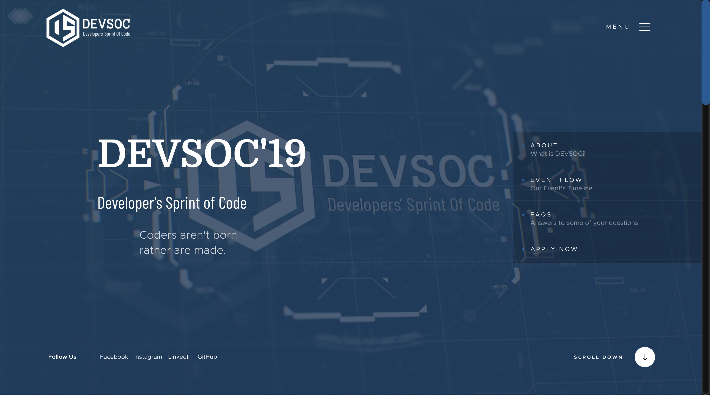

<p align="center"><a href="https://www.codechefvit.com" target="_blank"></a>
</p>

# DevSoc2K19-Website

> <Subtitle>
The official website of DevSoc 2K19 - CodeChef VIT Vellore

---

## Features
- Displays all information about the hackathon.

## Screenshots


## Requirements
- node >=8.x

## Instructions to run

```
$ git clone https://github.com/CodeChefVIT/DevSoc2K19-Website
$ cd DevSoc2K19-Website
$ npm install
$ npm start
```

## Contributors
- <a href="https://github.com/vinitshahdeo">Vinit Shahdeo</a>

## License

[](http://badges.mit-license.org)

<p align="center">
	With :heart: by <a href="https://www.codechefvit.com" target="_blank">CodeChef-VIT</a>
</p>
